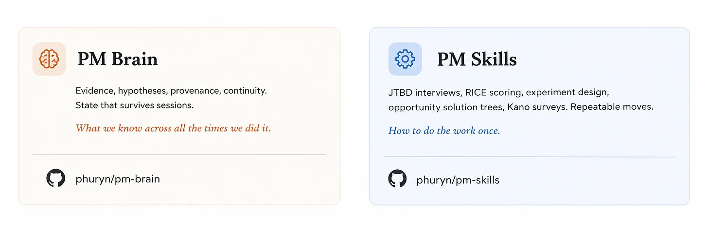

# Ark

[](https://docs.claude.com/en/docs/agents-and-tools/agent-skills/overview) [](LICENSE) [](tests/RESULTS.md) [](https://github.com/adnankresna/pm-skills)

**A second brain for product managers.** Plain markdown files in a folder on your laptop. Claude reads them before answering, writes to them after, sweeps them every Friday. No vector DB. No cloud. No agent memory tricks.

You manage one product. Your context is scattered across Notion, Linear, Slack, your dashboards, and your head. You ship a feature. Six weeks later, nobody remembers why you killed the other option. Ark fixes that.

> **See it in action:** [A week with Ark: Lena's first five days](./docs/walkthrough.md) is a short story of one PM using it on a real team. New here? Start there.

> **Research preview.** The architecture has months of dogfooding behind it on a sister content brain; the product as installed by real PMs in real organizations is days old. The eval suite (404 of 406 checks pass) is the floor. Real-world install feedback is how the next version gets better. Open [issues](https://github.com/adnankresna/open-adnan/issues) or join the conversation per the launch post.

## Install

Two stages: install the skill once, then bootstrap a brain in any folder you want.

### Stage 1: install the skill (one time)

The skill is global. It lands in `~/.claude/skills/ark/` and is available across every Claude Code session, in any working directory.

**macOS / Linux / WSL / Git Bash:**

```bash
mkdir -p ~/.claude/skills && \
  curl -L https://github.com/adnankresna/open-adnan/archive/refs/heads/main.tar.gz | \
  tar xz --strip-components=3 -C ~/.claude/skills open-adnan-main/.claude/skills/ark/
```

**Windows PowerShell:**

```powershell
$dest = "$env:USERPROFILE\.claude\skills"
New-Item -ItemType Directory -Force -Path $dest | Out-Null
irm "https://github.com/adnankresna/open-adnan/archive/refs/heads/main.zip" -OutFile "$env:TEMP\ark.zip"
Expand-Archive "$env:TEMP\ark.zip" "$env:TEMP\ark" -Force
Copy-Item "$env:TEMP\ark\open-adnan-main\.claude\skills\ark" $dest -Recurse -Force
Remove-Item "$env:TEMP\ark.zip","$env:TEMP\ark" -Recurse -Force
```

Either path pulls only the skill folder (`.claude/skills/ark/`) into your Claude Code skills directory. The rest of this repo (`example-brain/`, `tests/`, `docs/`) stays on GitHub for you to browse, not on your laptop.

### Stage 2: bootstrap a brain (per-product)

In any folder where you want the brain to live:

```bash
cd ~/projects/my-product-brain
claude
# then in the Claude Code prompt:
/ark
```

The skill detects what's already in the directory. An empty folder gets a fresh start (**greenfield**). A folder with existing PM artifacts (Notion exports, a Jira CSV, meeting notes) gets read and absorbed (**migration**). Either way, a short 5-batch interview captures company, role, and current priorities. The scaffold drops in, the brain commits locally. Never pushes.

> **Migration is for your current state. Don't backfill old artifacts retroactively.** Migration mode reads your active strategy, in-flight hypotheses, recent decisions, current stakeholder list. That's the goal. Don't try to manually `/ingest` 200 old interview transcripts and six months of Slack threads. If a stale artifact matters, it'll come up through current work and you'll ingest it then. Forcing them in now wastes a weekend and clogs the durable layer.

> Stuck? Universal fallback (any OS with `git`): `git clone https://github.com/adnankresna/open-adnan.git && cp -R open-adnan/.claude/skills/ark ~/.claude/skills/`. On Windows replace the `cp -R` with `Copy-Item open-adnan\.claude\skills\ark $env:USERPROFILE\.claude\skills\ -Recurse`.

## What it does (one loop)

The brain has one loop. Every task runs through it.

1. **Ingest.** Feed it an artifact (transcript, doc, screenshot, line in chat, app-connector pull from Notion / Jira / Slack).
2. **Source + synthesize.** The original copies to `source/` (immutable). The synthesis lands in `ingestion/` with observations tagged by speaker and date.
3. **Propagate.** The durable layer (`knowledge/`, `hypotheses/`, `decisions/`, `stakeholders/`) gets updated wherever the new signal applies. One artifact often touches four to six files.
4. **Tag.** Every load-bearing claim wears a provenance marker: a documented interview, a verbal stakeholder comment, your hunch, or general industry knowledge. The tags carry an implicit hierarchy: documented outweighs verbal, verbal outweighs intuition. The weighting is in plain text, so you can see when the brain is leaning on it and override it when your judgment says otherwise.
5. **Sweep.** Friday's `/review` reads the whole folder, flags what's drifting, drafts what needs your call.

Full list of provenance tags in the [glossary](./docs/glossary.md). Worked end-to-end example: [how it works](./docs/how-it-works.md).

## The six commands

| Command | What it does |
|---|---|
| `/ingest <thing>` | Feed an artifact into the brain: a file, a paste, a quick note in chat. The skill figures out the shape (interview, meeting, market signal, ad-hoc) and routes it. |
| `/prep <stakeholder>` | One-page brief before a meeting: their open asks, last unresolved concern, suggested questions. |
| `/review` | Weekly sweep. Six checks across the brain. Fixes small things directly, drafts the bigger ones for your call. |
| `/ideate <problem>` | Synthesis, not brainstorm. Loads strategy, insights, and hypotheses. Surfaces 3–7 directions, each tagged with the evidence behind it. |
| `/risk <feature>` | Five-area risk scan. Drafts hypothesis stubs for any area with no coverage. |
| `/plan <objective>` | Six-block draft plan: what we know, assumption vs evidence, who to interview, hypotheses to open, experiments to run, decision points. |

## What's in the repo

```
.claude/skills/ark/    # The canonical skill. Install this.
example-brain/              # Pre-scaffolded instance (browseable demo)
tests/                      # Eval suite. Synthetic scenarios + harness.
docs/                       # Architecture, how it works, testing, prior art
```

The brain itself (once you install and run `/ark`) lives in your working directory:

- **`knowledge/`**: your stable picture of strategy, product, users, market, and org
- **`hypotheses/`**: things you're tracking the evidence for (e.g., "invite-link friction blocks team activation under 50 seats")
- **`decisions/`**: calls you've made, with the evidence trail and what would reopen them
- **`stakeholders/`**: one file per person, with their asks and concerns
- **`ingestion/`**: synthesis of every interview, meeting, doc, or message the brain has read
- **`source/`**: the untouched originals, so the audit trail stays intact

## What it isn't

- Not a notes app. It's an opinionated structure with maintenance built in.
- Not a chatbot with memory. The memory lives in your repo, not in Claude.
- Not a vector database. Every file is plain markdown, grep-able by you.
- Not an agent memory system. Nothing is embedded, nothing is retrieved by similarity. The brain stores only what you and the agent deliberately wrote down.
- Not autonomous product management. Judgment stays with you. The brain makes the boring cross-referencing easier.

## Tests

**17 synthetic PM scenarios. 404 of 406 individual checks pass across the snapshots (≈99.5%).** The split: every structural check passes (329 / 329, 100%). Files exist, links resolve, evidence rows tagged, decision schemas valid. And 75 of 77 LLM-judge content checks pass (≈97%), with two judges missing on the two longest scenarios. Full breakdown in the [scoreboard](./tests/RESULTS.md).

Each scenario is a multi-turn PM situation (a churn investigation, a stakeholder cadence flag, a contradiction arriving 60 days after a decision) with cached input artifacts and ground-truth assertions. The harness spins up a fresh brain in a temp dir, replays the inputs through `claude -p`, runs structural assertions after every turn, and runs LLM-judge rubrics on substance at scenario end.

```bash
python tests/harness/run_scenario.py tests/scenarios/01-b2b-churn
```

- **[`tests/RESULTS.md`](./tests/RESULTS.md)**: scoreboard, per-scenario JSON snapshots, the two known residual judge failures (called out honestly, not hidden)
- **[`tests/README.md`](./tests/README.md)**: 90-second operator quickstart
- **[`tests/TESTING.md`](./tests/TESTING.md)**: scenario format, ground-truth schema, harness internals, cost model, coverage map
- **[`docs/testing.md`](./docs/testing.md)**: design rationale (why scenarios over per-turn unit tests, why LLM-as-judge is reserved)
- **[`docs/testing-decisions.md`](./docs/testing-decisions.md)**: running log of what eval runs taught us and the skill changes that came out of them

## Docs

- [`docs/walkthrough.md`](./docs/walkthrough.md): *Start here.* A week with Ark, told as a story.
- [`docs/why-this-matters.md`](./docs/why-this-matters.md): five failure modes that kill most AI memory systems by month three, and the five structural choices that answer them.
- [`docs/glossary.md`](./docs/glossary.md): every term used in Ark, defined in plain English.
- [`docs/how-it-works.md`](./docs/how-it-works.md): the technical version of the walkthrough, with files and folders.
- [`docs/architecture.md`](./docs/architecture.md): the design choices (deterministic scaffold + adaptive prompts) and why.
- [`docs/scaling.md`](./docs/scaling.md): how the brain stays healthy as the folder grows. Growth shapes, compression mechanisms, realistic envelope numbers.
- [`docs/testing.md`](./docs/testing.md): how the eval suite works, scenario format, ground-truth schema.
- [`docs/testing-decisions.md`](./docs/testing-decisions.md): running log of what eval runs taught us and the design calls that came out of them. Read when an assertion or scaffold rule looks arbitrary and you want to know *why it's there*.
- [`docs/prior-art.md`](./docs/prior-art.md): Zettelkasten, RAG memory, agent OS patterns. What's borrowed and what's new.

## Compose with PM Skills



Ark is the memory layer. [PM Skills](https://github.com/adnankresna/pm-skills) are the workflow modules: how to run a JTBD interview, how to score with RICE, how to design an experiment. They compose. The skill is how to do the work once. The brain is what you know across all the times you did it.

## Contributing

Issues first, please. The skill is the load-bearing artifact for every install, so changes need discussion before code. The flow:

1. Open a GitHub issue describing the use case, the missing behavior, or the scenario you'd like covered. Link to your own brain folder if you can. Concrete examples beat abstract requests.
2. For documentation, walkthrough, or scenario contributions (new `tests/scenarios/<NN-slug>/`), a PR after issue discussion is welcome.
3. For changes to the skill itself (`.claude/skills/ark/`), please wait for explicit go-ahead on the issue before opening a PR. The eval suite needs to re-run and the example-brain may need to mirror structural changes. The repo-level [`CLAUDE.md`](./CLAUDE.md) describes the work patterns in detail.

Run the eval suite before sending a PR if your change could affect any scenario:

```bash
python tests/harness/run_all.py --max-cost 50
```

## License

[MIT](./LICENSE).

## Credits

Designed and maintained by Adnan.
